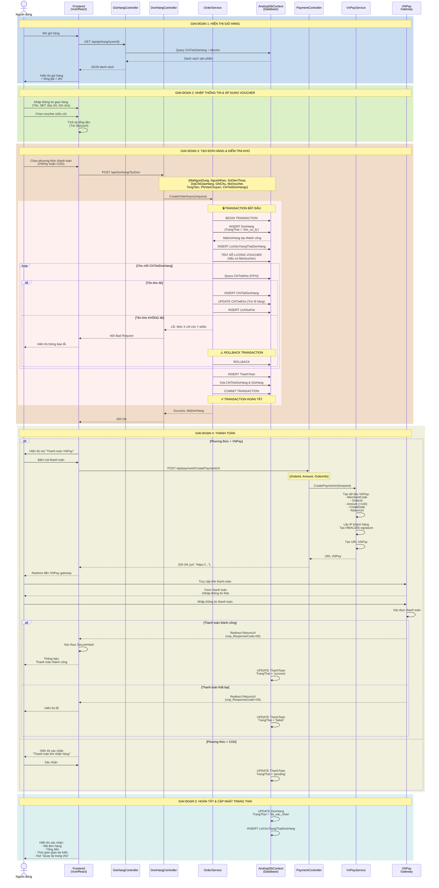
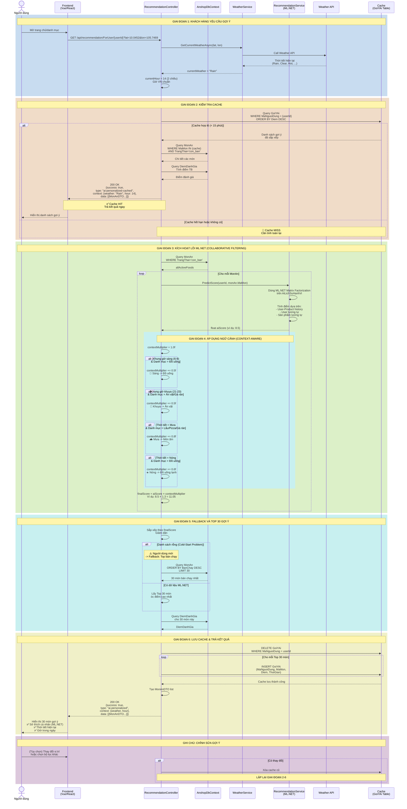

# 🎯 AnFood - 3 Sơ đồ Sequence Chính (Mermaid)

Tài liệu này tích hợp tất cả **3 sơ đồ Mermaid** cho hệ thống AnFood.
Bạn có thể xem preview trực tiếp hoặc copy từng sơ đồ sang [Mermaid Live Editor](https://mermaid.live).

---

## 📌 Hướng dẫn nhanh

### **Xem trên GitHub**:
Mermaid tự động render → Bạn có thể thấy sơ đồ ngay trên trang này!

### **Xem trên VS Code**:
1. Cài extension: `Markdown Preview Mermaid Support`
2. Mở file này → Nhấn `Ctrl+Shift+V` → Preview

### **Xem online**:
1. Copy từng sơ đồ dưới đây
2. Paste vào https://mermaid.live
3. Preview ngay lập tức

---

## 🛒 1️⃣ Sơ đồ Đặt hàng & Thanh toán (Checkout & Payment)

**Công nghệ chính**: 
- ✅ Database Transactions (ACID)
- ✅ FIFO Inventory Check
- ✅ VNPay Payment Gateway
- ✅ JWT Authentication

---

## 🍽️ 2️⃣ Sơ đồ Gợi ý Cá nhân hóa (Personalized Recommendation)

**Công nghệ chính**:
- ✅ ML.NET Matrix Factorization (Collaborative Filtering)
- ✅ Weather API Integration
- ✅ Context-Aware Boosting (Thời tiết + Giờ)
- ✅ 15-minute Cache Strategy

---

## 💬 3️⃣ Sơ đồ Trò chuyện AI (Gemini AI Chatbot)

```mermaid
sequenceDiagram
    actor U as Người dùng
    participant FE as Frontend<br/>(Vue/React)
    participant CBC as ChatbotController
    participant CBS as ChatbotService
    participant DB as AnshopDbContext
    participant RS as RecommendationService<br/>(ML.NET)
    participant GEMINI as Gemini API<br/>(Google)

    rect rgb(200, 220, 240)
        Note over U,GEMINI: GIAI ĐOẠN 1: KHÁCH HÀNG GỬI TIN NHẮN
        U->>FE: Nhập tin nhắn vào chatbot<br/>"Em muốn ăn gì buổi chiều?"
        FE->>CBC: POST /api/chatbot/SendMessage<br/>{MaNguoiDung: 123,<br/>NoiDung: "..."}
    end

    rect rgb(240, 220, 200)
        Note over U,GEMINI: GIAI ĐOẠN 2: LƯU TIN NHẮN NGƯỜI DÙNG
        CBC->>DB: INSERT LichSuChat<br/>(MaNguoiDung, NoiDung,<br/>NguoiGui="User", ThoiGian)
        DB-->>CBC: Lưu thành công
        
        CBC->>CBS: LayPhanHoiTuAiAsync(123, "...")
    end

    rect rgb(220, 240, 200)
        Note over U,GEMINI: GIAI ĐOẠN 3: KÍCH HOẠT ML.NET<br/>LỌC RA TOP 5 MÓN
        CBS->>DB: Query MonAn<br/>WHERE TrangThai='con_ban'
        DB-->>CBS: allActiveFoods
        
        alt Khách đã đăng nhập (userId > 0)
            Note over CBS,RS: 🧠 ML.NET Collaborative Filtering
            
            loop Cho mỗi MonAn
                CBS->>RS: PredictScore(userId=123, monAn.MaMon)
                RS->>RS: Matrix Factorization<br/>từ AiLichSuHanhVi
                RS-->>CBS: float score (ví dụ: 8.7)
            end
            
            CBS->>CBS: Sắp xếp theo score<br/>Lấy Top 5 món
        else Khách vãng lai (userId = null)
            Note over CBS,RS: ❄️ Cold-Start Problem<br/>-> Top bán chạy
            CBS->>DB: Query MonAn<br/>ORDER BY BanChay DESC<br/>LIMIT 5
            DB-->>CBS: Top 5 bán chạy nhất
        end
        
        CBS->>CBS: Tạo top5Foods array<br/>[{id, name, price,<br/>tag: "Cá nhân hóa"}, ...]
    end

    rect rgb(200, 240, 240)
        Note over U,GEMINI: GIAI ĐOẠN 4: LẤY LỊCH SỬ CHAT<br/>ĐỂ AI NHỚ NGỮ CẢNH
        CBS->>DB: Query LichSuChat<br/>WHERE MaNguoiDung = 123<br/>ORDER BY ThoiGian DESC<br/>LIMIT 5
        DB-->>CBS: 5 tin nhắn gần nhất
        
        CBS->>CBS: Đảo ngược thứ tự (Cũ -> Mới)<br/>lichSuChat = "User: ...<br/>Bot: ...<br/>User: Em muốn ăn gì?"
    end

    rect rgb(240, 240, 200)
        Note over U,GEMINI: GIAI ĐOẠN 5: TẠO PROMPT & GỬI GEMINI
        CBS->>CBS: Tạo promptSystem:<br/>"Bạn là trợ lý AI FastBite<br/>Top 5 món: [{...}]<br/><br/>🚨 YÊU CẦU JSON:<br/>{<br/>'message': 'Câu tư vấn',<br/>'suggestedProductIds': [...]<br/>}"
        
        CBS->>CBS: Tạo fullPrompt:<br/>promptSystem + LỊCH SỬ<br/>+ "Khách hỏi: ..."
        
        Note over CBS: ⚡ Ép Gemini trả JSON<br/>Chỉ gửi Top 5<br/>-> Token tiết kiệm
        
        CBS->>CBS: Tạo request body:<br/>{contents, responseMimeType}
        CBS->>GEMINI: POST /v1beta/models/gemini-2.5-flash
        Note over CBS,GEMINI: ?key=
        
        Note over GEMINI: 🤖 Gemini xử lý:<br/>1. Đọc prompt + lịch sử<br/>2. Hiểu ý khách<br/>3. Tư vấn Top 5 món<br/>4. Trả JSON định dạng
        
        GEMINI-->>CBS: 200 OK<br/>{"candidates": [{<br/>"content": {<br/>"parts": [{<br/>"text": "{<br/>'message': 'Buổi chiều nóng...',<br/>'suggestedProductIds': [1, 5]<br/>}"<br/>}]}}]}
        
        CBS->>CBS: Parse JSON response<br/>Deserialize -> AiResponseDto
    end

    rect rgb(220, 200, 220)
        Note over U,GEMINI: GIAI ĐOẠN 6: LƯU TIN NHẮN BOT<br/>VÀ TRẢ PHẢN HỒI
        CBS->>DB: INSERT LichSuChat<br/>(MaNguoiDung, NoiDung=message,<br/>NguoiGui="Bot", ThoiGian)
        DB-->>CBS: Lưu thành công
        
        Note over CBS,DB: ✅ Lưu lịch sử để:<br/>- Tracking hành vi<br/>- Huấn luyện ML<br/>- Hiểu user tốt hơn
        
        CBS-->>CBC: AiResponseDto<br/>{message: "...",<br/>suggestedProductIds: [1, 5]}
    end

    rect rgb(200, 220, 220)
        Note over U,GEMINI: GIAI ĐOẠN 7: HIỂN THỊ PHẢN HỒI<br/>TRÊN FRONTEND
        CBC-->>FE: 200 OK<br/>AiResponseDto JSON
        
        FE->>FE: Hiển thị tin nhắn Bot
        FE->>FE: Lấy suggestedProductIds = [1, 5]<br/>Query thông tin:<br/>- Tên, Giá, Hình, Đánh giá
        
        FE-->>U: Hiển thị:<br/>1️⃣ Tin nhắn bot<br/>2️⃣ Thẻ sản phẩm<br/>[Cơm tấm - 45K]<br/>[Cơm gà - 50K]<br/>Nút: Thêm giỏ, Chi tiết
    end

    rect rgb(240, 200, 220)
        Note over U,GEMINI: GIAI ĐOẠN 8: NGƯỜI DÙNG TƯƠNG TÁC & LẶP LẠI
        
        alt Người dùng tiếp tục chat
            U->>FE: Gửi tin nhắn tiếp:<br/>"Em muốn gà rán + Coca"
            Note over FE: 🔄 LẶP LẠI GIAI ĐOẠN 1<br/>Lịch sử sẽ được<br/>Gemini nhớ
        else Người dùng thêm vào giỏ
            U->>FE: Bấm "Thêm vào giỏ"
            FE->>FE: Tăng số lượng GioHang
            Note over FE: ➕ Hành động được ghi<br/>vào AiLichSuHanhVi<br/>cho lần gợi ý tiếp
        else Người dùng kết thúc chat
            U->>FE: Đóng chatbot
            FE-->>U: Lưu lịch sử<br/>(Mở lại sau)
        end
    end

    rect rgb(255, 240, 240)
        Note over U,GEMINI: ⚠️ EXCEPTION HANDLING
        
        alt API Gemini timeout
            CBS->>CBS: Bắt exception
            CBS-->>CBC: AiResponseDto<br/>{message: "Dạ máy chủ đang quá tải...",<br/>suggestedProductIds: []}
            CBC-->>FE: 500 Error
            FE-->>U: Hiển thị lỗi nhân ái
        end
    end
```

**Công nghệ chính**:
- ✅ Gemini 2.5 Flash API
- ✅ ML.NET Top 5 Filtering
- ✅ Lịch sử Chat (Context Awareness)
- ✅ JSON Response Forcing
- ✅ Cold-Start Problem Handling

---

## 📊 So sánh 3 Sơ đồ

| Tính năng | Checkout | Recommendation | Chatbot |
|-----------|----------|-----------------|---------|
| **Giai đoạn** | 5 | 7 | 8 |
| **API gọi** | VNPay | Weather API | Gemini API |
| **Cache** | ❌ | ✅ (15 min) | ❌ |
| **ML.NET** | ❌ | ✅ | ✅ |
| **Database Transaction** | ✅ | ❌ | ✅ (Chat log) |
| **Context-Aware** | ❌ | ✅ | ✅ (Chat history) |

---

## 🎨 Hướng dẫn sử dụng từng định dạng

### **Mermaid (Tệp `.mmd`)**
- Dùng cho: Quick share, GitHub, Markdown
- Preview: Mermaid Live, VS Code (extension)
- Export: PNG, PDF, SVG

### **PlantUML (Tệp `.puml`)**
- Dùng cho: Enterprise, chi tiết cao
- Preview: PlantUML Online
- Export: PNG, PDF, SVG, EPS

---

## 💡 Mẹo sử dụng hiệu quả

1. **GitHub**: Push file markdown này lên → Mermaid tự động render
2. **VS Code**: Cài extension Mermaid Preview → Mở file → `Ctrl+Shift+V`
3. **Slides**: Export PNG → Insert vào PowerPoint/Google Slides
4. **Share nhanh**: Copy code → Paste vào https://mermaid.live
5. **Documentation**: Tích hợp vào wiki/Confluence

---

## 📝 Chú ý quan trọng

- ⚠️ **Checkout**: Transaction phải ACID để tránh mất dữ liệu
- ⚠️ **Recommendation**: Cache 15 phút để balance giữa performance & freshness
- ⚠️ **Chatbot**: JSON forcing để tránh lỗi parsing

---

**Tạo bởi**: GitHub Copilot  
**Ngày tạo**: 2026-06-04  
**Phiên bản**: 1.0

