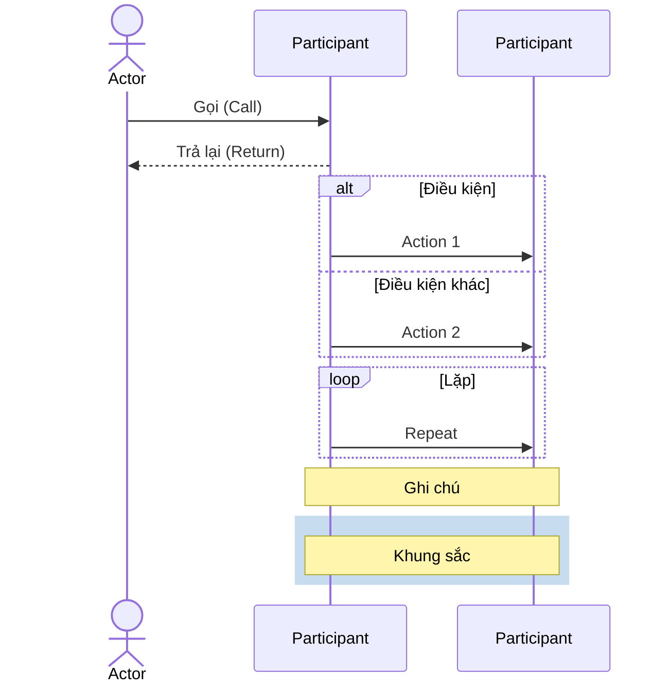

# 🎯 Hướng dẫn sử dụng Mermaid Sequence Diagrams - AnFood

Tệp này chứa 3 sơ đồ tuần tự (Sequence Diagram) định dạng **Mermaid** chi tiết cho hệ thống AnFood.

---

## 📁 Danh sách các file Mermaid

### 1. **01_Checkout_Payment_Sequence.mmd**
   - Sơ đồ: **Đặt hàng và Thanh toán** (Checkout & Payment)
   
### 2. **02_Recommendation_Sequence.mmd**
   - Sơ đồ: **Gợi ý món ăn thông minh** (Personalized Recommendation)
   
### 3. **03_Chatbot_AI_Sequence.mmd**
   - Sơ đồ: **Trò chuyện AI (Gemini Chatbot)**

---

## 🚀 Cách sử dụng Mermaid

### **1️⃣ Xem online - Mermaid Live Editor (NHANH NHẤT)**

🔗 Truy cập: https://mermaid.live

**Bước 1**: Mở link trên
**Bước 2**: Copy toàn bộ nội dung file `.mmd`
**Bước 3**: Paste vào editor bên trái
**Bước 4**: Sơ đồ hiển thị tự động bên phải

---

### **2️⃣ Sử dụng VS Code (MỌI NGƯỜI)**

**Bước 1**: Cài extension **Markdown Preview Mermaid Support**
   - Tìm: `Markdown Preview Mermaid Support` của `Matt Bierner`
   - Hoặc ID: `bierner.markdown-mermaid`

**Bước 2**: Tạo file markdown (`.md`) hoặc mở file tồn tại

**Bước 3**: Chèn code Mermaid:
```markdown
# Sơ đồ 1: Checkout & Payment

```mermaid
[Copy nội dung từ 01_Checkout_Payment_Sequence.mmd tại đây]
```

**Bước 4**: Nhấn **Ctrl+Shift+V** để preview
   - Sơ đồ sẽ hiển thị ngay trong VS Code!

---

### **3️⃣ Tạo file Markdown tích hợp tất cả 3 sơ đồ**

Tạo file `AnFood_AllDiagrams.md`:

```markdown
# AnFood - 3 Sơ đồ Sequence Chính

## 1️⃣ Sơ đồ Đặt hàng & Thanh toán

\`\`\`mermaid
[Copy từ 01_Checkout_Payment_Sequence.mmd]
\`\`\`

## 2️⃣ Sơ đồ Gợi ý Cá nhân hóa

\`\`\`mermaid
[Copy từ 02_Recommendation_Sequence.mmd]
\`\`\`

## 3️⃣ Sơ đồ Chatbot AI

\`\`\`mermaid
[Copy từ 03_Chatbot_AI_Sequence.mmd]
\`\`\`
```

---

### **4️⃣ GitHub (Tự động render)**

Nếu đưa file `.mmd` lên GitHub:
1. Tạo file `README.md` trong thư mục `diagrams/`
2. Dán nội dung Mermaid vào trong code block:

```markdown
# AnFood System Diagrams

## Checkout & Payment

```mermaid
[Nội dung từ file .mmd]
```
```

GitHub sẽ **tự động render** Mermaid diagram khi bạn xem!

---

### **5️⃣ Export thành hình ảnh (PNG/PDF)**

#### **Cách 1: Từ Mermaid Live Editor**
1. Truy cập https://mermaid.live
2. Paste code vào
3. Bấm **Download** → Chọn format: PNG, PDF, SVG

#### **Cách 2: Dùng CLI (Command Line)**

**Cài đặt**:
```bash
npm install -g @mermaid-js/mermaid-cli
```

**Export**:
```bash
# PNG
mmdc -i 01_Checkout_Payment_Sequence.mmd -o 01_Checkout.png

# PDF
mmdc -i 01_Checkout_Payment_Sequence.mmd -o 01_Checkout.pdf

# SVG (độ sắc cao)
mmdc -i 01_Checkout_Payment_Sequence.mmd -o 01_Checkout.svg
```

#### **Cách 3: Dùng Obsidian (Nếu sử dụng)**
1. Mở Obsidian
2. Tạo note mới
3. Chèn code Mermaid:
````markdown
```mermaid
[Nội dung từ file .mmd]
```
````
4. Obsidian sẽ render tự động
5. Export thành PDF

---

### **6️⃣ PowerPoint/Google Slides**

**Bước 1**: Export sang PNG từ Mermaid Live
**Bước 2**: Insert hình PNG vào slide

---

## 📊 Cấu trúc file Mermaid



**Ký hiệu Mermaid**:
- `->` : Gọi đơn giản
- `->>` : Gọi bình thường
- `-->>` : Trả lại (dashed)
- `alt` / `else` : Điều kiện
- `loop` : Vòng lặp
- `Note` : Ghi chú
- `rect` : Khung màu

---

## ✨ So sánh PlantUML vs Mermaid

| Tính năng | PlantUML | Mermaid |
|-----------|----------|--------|
| Cú pháp | Phức tạp | Đơn giản |
| Online editor | Chậm | Rất nhanh |
| VS Code support | Cần extension | Dễ dàng |
| GitHub render | Không tự động | ✅ Tự động |
| Export đa format | Có | Có |
| Đường truyền data | Chi tiết | Đơn giản |

**→ Mermaid tốt hơn cho:**
- Chia sẻ nhanh
- GitHub/Markdown
- Prototype nhanh
- Team documentation

**→ PlantUML tốt hơn cho:**
- Diagram phức tạp
- Enterprise
- Tùy chỉnh chi tiết

---

## 🎯 Các bước khuyên dùng

### **Cho Dev**:
1. Cài extension Mermaid Preview trên VS Code
2. Mở file `.mmd` → Preview để hiểu workflow
3. Copy vào Markdown để share trong PR

### **Cho Team Lead**:
1. Export PNG từ Mermaid Live
2. Chèn vào document/slide
3. Share link GitHub/Confluence

### **Cho Documentation**:
1. Tạo file `README.md` tích hợp tất cả Mermaid
2. Push lên GitHub
3. Mermaid tự động render khi view

---

## 💡 Lợi ích của Mermaid

✅ **Dễ bảo trì**: Chỉ cần sửa text, không cần design tool  
✅ **Version control**: Có thể track change trên Git  
✅ **Collaborative**: Dễ merge conflict resolution  
✅ **GitHub-native**: Không cần plugin  
✅ **Fast**: Render nhanh, lightweight  
✅ **Share**: Copy link Mermaid Live  

---

## 🔗 Tài liệu tham khảo

- **Mermaid Documentation**: https://mermaid.js.org/
- **Mermaid Live Editor**: https://mermaid.live
- **VS Code Extension**: `Markdown Preview Mermaid Support`
- **Syntax Guide**: https://mermaid.js.org/syntax/sequenceDiagram.html

---

## 📝 Nội dung các sơ đồ

### **1. Checkout & Payment (01_Checkout_Payment_Sequence.mmd)**
- 5 giai đoạn: Giỏ hàng → Thông tin → Tạo đơn → Thanh toán → Xác nhận
- Transaction ACID, FIFO inventory check, VNPay integration
- **~280 dòng code Mermaid**

### **2. Recommendation (02_Recommendation_Sequence.mmd)**
- 7 giai đoạn: Request → Cache check → ML.NET → Context boost → Fallback → Cache save → Display
- ML.NET Matrix Factorization, Weather API, Context-aware boosting
- **~220 dòng code Mermaid**

### **3. Chatbot AI (03_Chatbot_AI_Sequence.mmd)**
- 8 giai đoạn: Message → Save → ML.NET Top 5 → Chat history → Gemini → Save → Display → Interact
- Gemini API, JSON response forcing, ML.NET cold-start handling
- **~250 dòng code Mermaid**

---

**Tạo bởi**: GitHub Copilot  
**Ngày tạo**: 2026-06-04  
**Phiên bản**: 1.0 (Mermaid)

